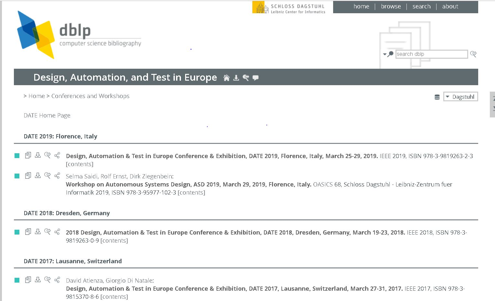
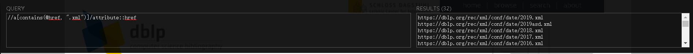
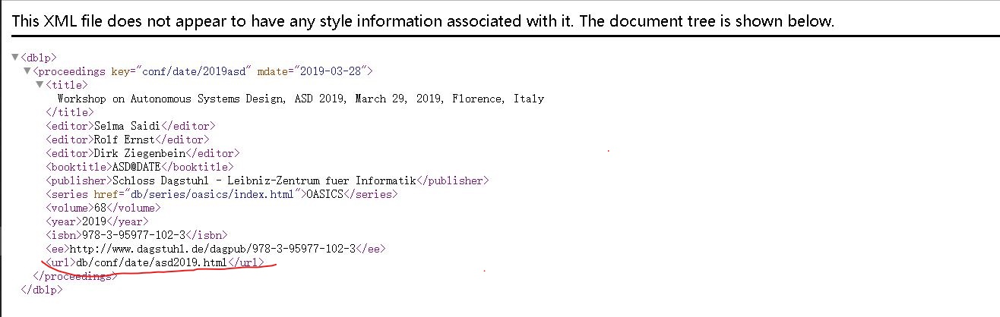
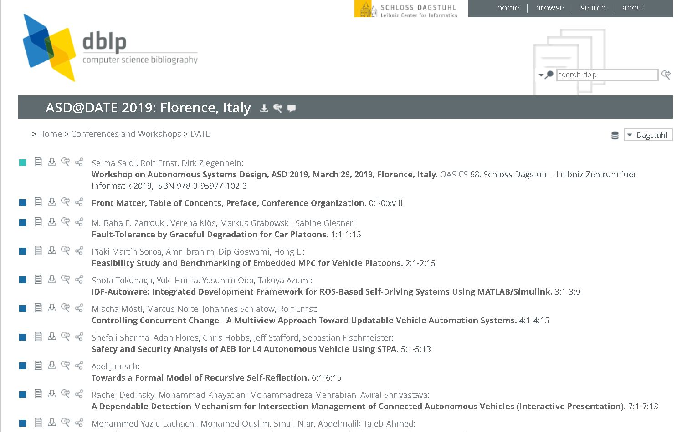
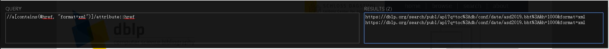
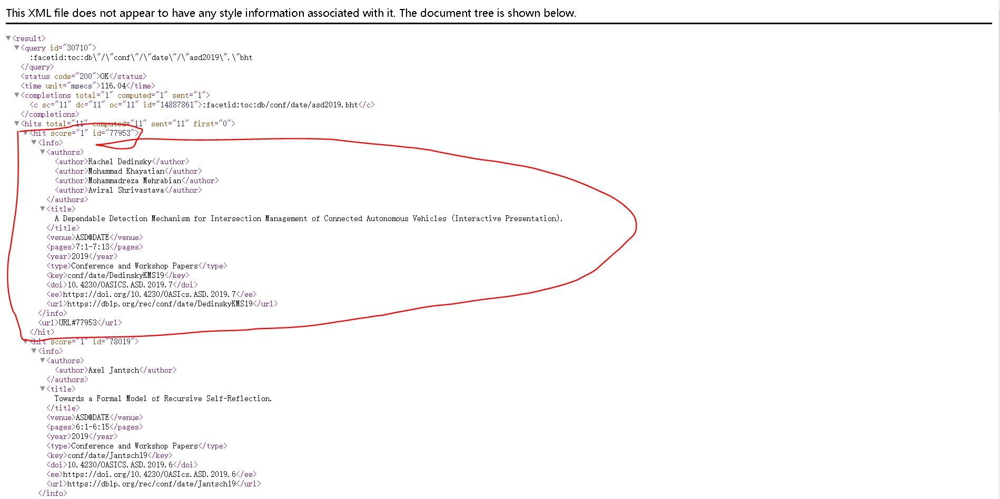
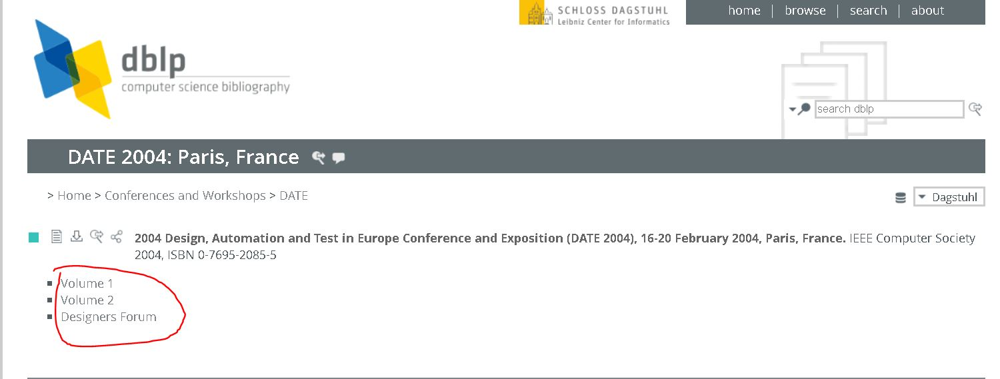
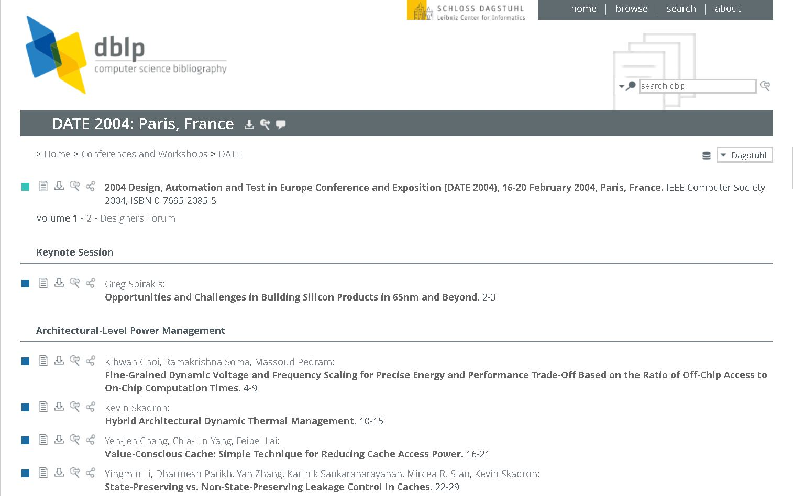
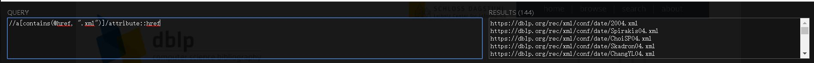
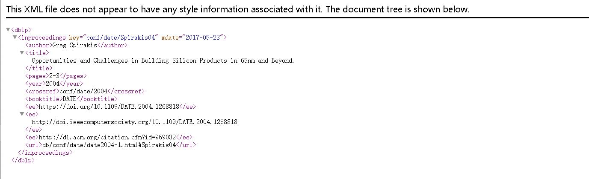

## 构建会议的基础信息（xml文档）

### 例如https://dblp.org/db/conf/date/

### 一、 打开https://dblp.org/db/conf/date/

### 二、获取该页面下每个年份的xml文档地址

遍历每个年份的xml文档，例如打开https://dblp.org/rec/xml/conf/date/2019asd.xml

### 三、将https://dblp.org/与url标签内的相对地址拼接成完整url，并进入该页面，即为会议内每个年份的论文收录的首页面

### 四、找到该页面下收录了所有论文基础信息的xml文档地址并进入

例如https://dblp.org/search/publ/api?q=toc%3Adb/conf/date/asd2019.bht%3A&h=1000&format=xml

每个hit标签内就是一篇论文的基础信息（作者，title，年份，论文收录地址）

## 对于一个年份内有多个volume的情况，需另作处理

例如https://dblp.org/db/conf/date/date2004.html

### 前三步骤一样，从第四步开始

### 四、获取每个volume的地址并进入

### 五、需要一个一个抓取论文的xml文档，再拼接到一起

